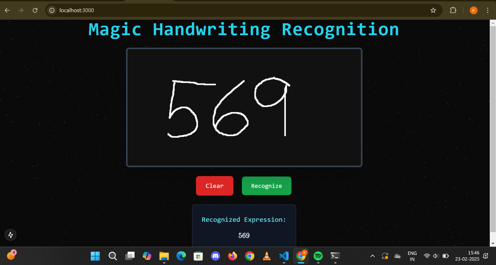
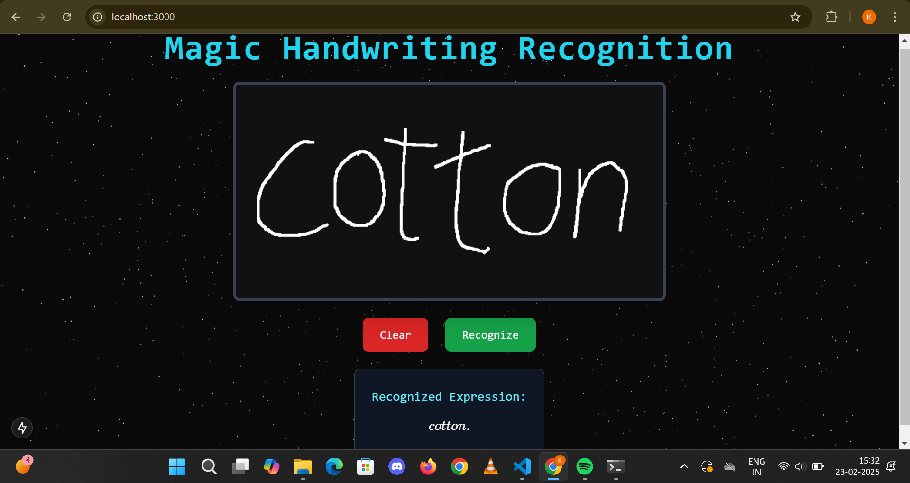

# Handwriting Recognition

  


*Handwriting Recognition using Microsoft's TrOCR model*

## Overview
This project is a **Handwriting Recognition Web App** that allows users to write on a canvas and recognize handwritten mathematical expressions using deep learning. The backend is powered by **FastAPI** and **Microsoft's TrOCR model**, while the frontend is built with **Next.js and Tailwind CSS**.

## Features
- 🎨 **Canvas** for handwriting input
- 🔍 **Handwriting recognition** using TrOCR
- 🌐 **FastAPI backend** for processing images
- 🎭 **Interactive UI** with animations and effects
- 🔧 **Local deployment guide** for easy setup

---

## Why TrOCR?
We chose **Microsoft's TrOCR (Transformer-based Optical Character Recognition)** model because:
- It is **pre-trained on diverse handwritten datasets**, making it well-suited for this task.
- Uses **Vision Transformer (ViT) + GPT architecture** for accurate text recognition.
- Works well **without additional training** for general handwriting recognition.

### 🔍 Understanding TrOCR
Microsoft's **TrOCR model** is a **deep learning-based OCR system** that combines:
- **Vision Transformer (ViT):** Extracts visual features from handwritten images.
- **Autoregressive GPT Decoder:** Converts visual data into human-readable text.
- **Pre-training on handwritten datasets:** Ensures high accuracy without the need for additional fine-tuning.

🔹 **Why It Works Well for This Project?**
TrOCR's transformer-based architecture allows it to handle complex handwriting, making it an excellent choice for OCR tasks. Unlike traditional CNN-based models, TrOCR adapts better to variations in writing styles and character distortions.

---

## Local Setup Instructions

### 1️⃣ Clone the Repository
```sh
git clone https://github.com/kamalan2k4/handwriting-recognition.git
cd handwriting-recognition
```

### 2️⃣ Set Up the Backend
#### Install Dependencies
```sh
cd backend
python -m venv env
source env/bin/activate  # On Windows: env\Scripts\activate
pip install -r requirements.txt
```


#### Run the Backend
```sh
uvicorn main:app --host 0.0.0.0 --port 8000 --reload
```
The API will be available at: [http://localhost:8000/docs](http://localhost:8000/docs)


---

### 3️⃣ Set Up the Frontend
#### Install Dependencies
```sh
cd ../frontend
npm install
```


#### Run the Frontend
```sh
npm run dev
```
Your app will be available at: [http://localhost:3000](http://localhost:3000)


---

## Why Not Deployed?
We initially attempted to deploy this project on **Render (Backend)** and **Vercel (Frontend)**. However, deployment **failed due to the following issues**:

1. **Render's Free Tier (512MB RAM) is insufficient** for running the TrOCR model, which requires more memory.
2. **Torch & Transformers dependencies caused high resource usage**, leading to out-of-memory errors.


### ⚡ Alternative Solutions
- 🛠 **Running locally** ensures smooth execution **without memory constraints**.
- ☁️ **Exploring GPU-based cloud services** (AWS, Hugging Face Spaces) for future deployment.
- 📦 **Optimizing dependencies** to reduce memory usage.

💡 **For now, follow the local setup guide to run the project successfully!** 🚀

---


### 📌 Author
**Kamalan** | [GitHub](https://github.com/kamalan2k4)

